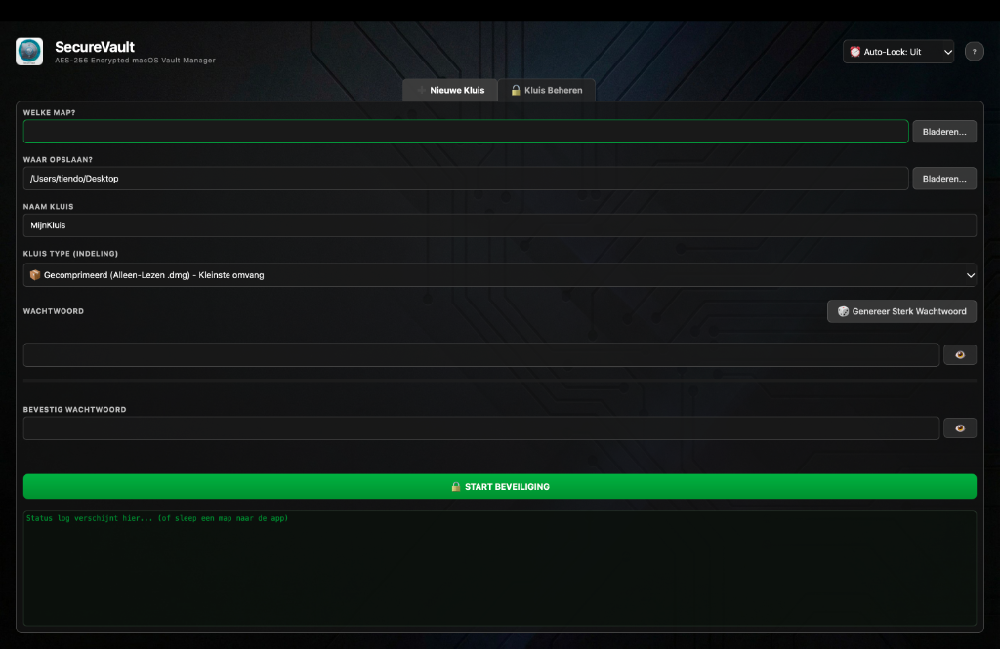

# 🔒 SecureVault for Mac



**SecureVault** is een moderne, minimalistische desktopapplicatie voor macOS waarmee je eenvoudig mappen kunt beveiligen in versleutelde kluizen (`.dmg` disk images).

De applicatie is geschreven in **Python** met **PySide6 (Qt)** en maakt gebruik van native macOS-beveiligingstools (`hdiutil`) voor robuuste **AES‑256 encryptie**. Geen externe encryptielibraries, geen cloud, geen vendor lock‑in — alles blijft lokaal op je Mac.


---

## ✨ Kenmerken

* **🔐 AES‑256 Encryptie**
  Gebruikt de industriestandaard voor encryptie via macOS `hdiutil`.

* **🌙 Modern Dark Design**
  Strakke, minimalistische dark UI gebouwd met Qt.

* **📐 Slimme grootte‑berekening**
  De benodigde kluisgrootte wordt automatisch berekend op basis van de mapinhoud, inclusief ~10% veiligheidsmarge.

* **🚫 Geen pop‑ups**
  Wachtwoorden worden veilig en direct aan het systeem doorgegeven zonder storende macOS‑dialoogvensters.

* **⚙️ Multithreading**
  Versleutelingsprocessen draaien in de achtergrond (`QThread`), zodat de interface altijd responsief blijft.

* **📦 Compressie**
  De uiteindelijke kluis wordt opgeslagen als een gecomprimeerde (`UDZO`) disk image om schijfruimte te besparen.

---

## 🔑 Kernprincipes & Veiligheid

### Volledig lokaal

* Geen cloudopslag
* Geen netwerkverkeer
* Geen externe services

Alles gebeurt lokaal op je Mac via native tooling.

### Transparante beveiliging

* Encryptie wordt uitgevoerd door macOS zelf
* Geen custom crypto‑implementaties
* Geen verborgen opslag van wachtwoorden

### Gebruiker aan het stuur

* Jij kiest welke map wordt versleuteld
* Jij bepaalt de locatie en naam van de kluis
* Zonder impliciete acties of automatische uploads

---

## 🛠️ Vereisten

Om SecureVault te gebruiken heb je het volgende nodig:

* **macOS** (vereist vanwege `hdiutil`)
* **Python 3.9+**
* **PySide6**

---

## 🚀 Installatie

### 1. Download of clone het project

Plaats de projectmap lokaal op je Mac.

### 2. Installeer de vereiste Python-bibliotheek

Open Terminal, navigeer naar de projectmap en voer uit:

```
pip3 install PySide6
```

---

## ▶️ Applicatie starten

Start de applicatie handmatig vanuit de Terminal:

```
python3 securevault_gui.py
```

*(Bestandsnaam kan afwijken afhankelijk van je projectstructuur.)*

---

## 🧠 Hoe SecureVault werkt (hoog niveau)

1. Je selecteert een map om te beveiligen
2. SecureVault berekent de benodigde kluisgrootte
3. macOS maakt een versleutelde `.dmg` met AES‑256
4. De map wordt veilig gekopieerd naar de kluis
5. De kluis wordt gecomprimeerd en opgeslagen

Het originele bestandssysteem wordt hierbij niet aangepast.

---

## ❌ Bewuste beperkingen

SecureVault is bewust beperkt in scope om veiligheid en voorspelbaarheid te garanderen.

De applicatie doet **niet**:

* ❌ Synchroniseren met cloudservices
* ❌ Bestanden automatisch uploaden of delen
* ❌ Wachtwoorden opslaan of herstellen
* ❌ Real‑time mappen monitoren
* ❌ Cross‑platform ondersteuning bieden

Elke kluis wordt expliciet en handmatig aangemaakt.

---

## 🎯 Doel van dit project

SecureVault is gebouwd als een **persoonlijke beveiligingsutility** voor macOS.

Het doel is een eenvoudige, transparante manier bieden om gevoelige mappen te versleutelen met tooling die het besturingssysteem al vertrouwt — zonder extra complexiteit, accounts of abonnementen.

Dit project is bedoeld voor persoonlijk en educatief gebruik. Forks en verbeteringen zijn welkom.
